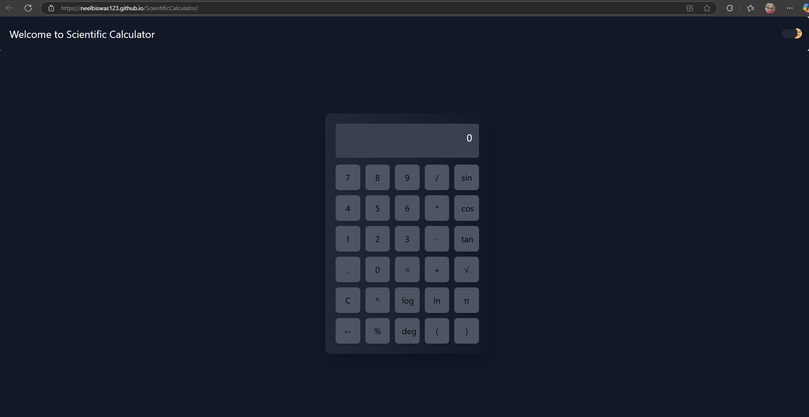

# 📐 Scientific Calculator

A sleek and responsive scientific calculator built using **React** and **Tailwind CSS**. Perform  calculations effortlessly with an intuitive UI and modern design.

## 🚀 Features

- ✅ Basic arithmetic operations: Addition, Subtraction, Multiplication, Division
- ✅ Advanced mathematical functions: Square roots, Exponents, Logarithms 
- ✅ Clean and responsive UI powered by Tailwind CSS
- ✅ Fast and efficient computations using React state management
- ✅ Keyboard support for quick input

## 🖥️ Demo

🔗 [Live Preview] https://neelbiswas123.github.io/ScientificCalculator/
💻 Check out the website in action!

## 🛠️ Technologies Used

- **React** - Component-based UI framework
- **Tailwind CSS** - Utility-first styling for responsiveness
- **JavaScript** - Core programming language

## 📂 Installation

Follow these simple steps to set up the project locally:

```sh
git clone https://github.com/NeelBiswas123/ScientificCalculator.git
cd ScientificCalculator
In terminal :- 
npm install 
    &
npm start



